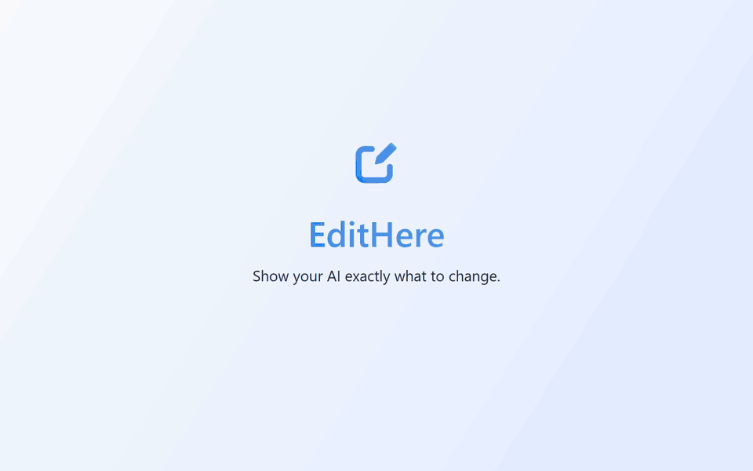
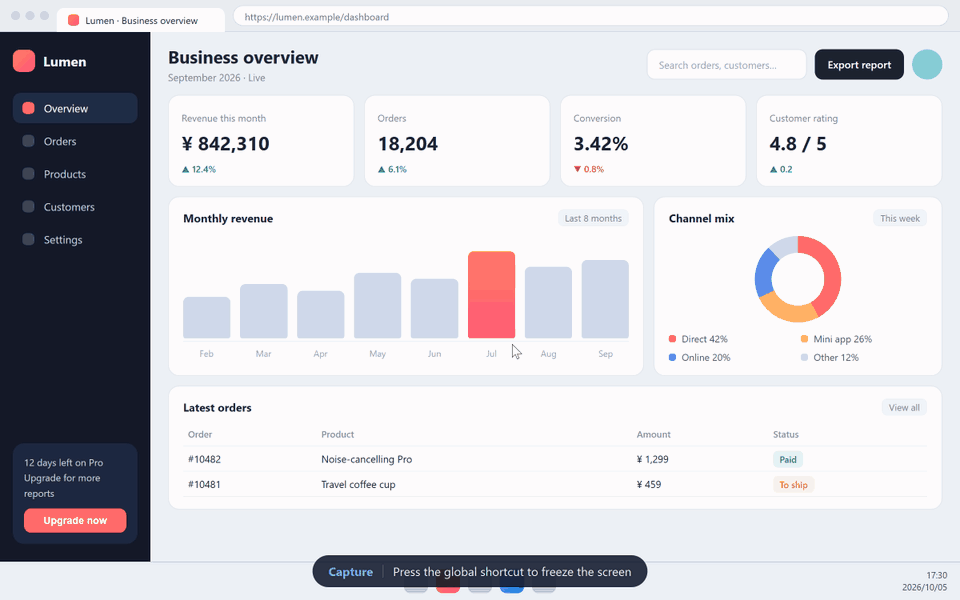
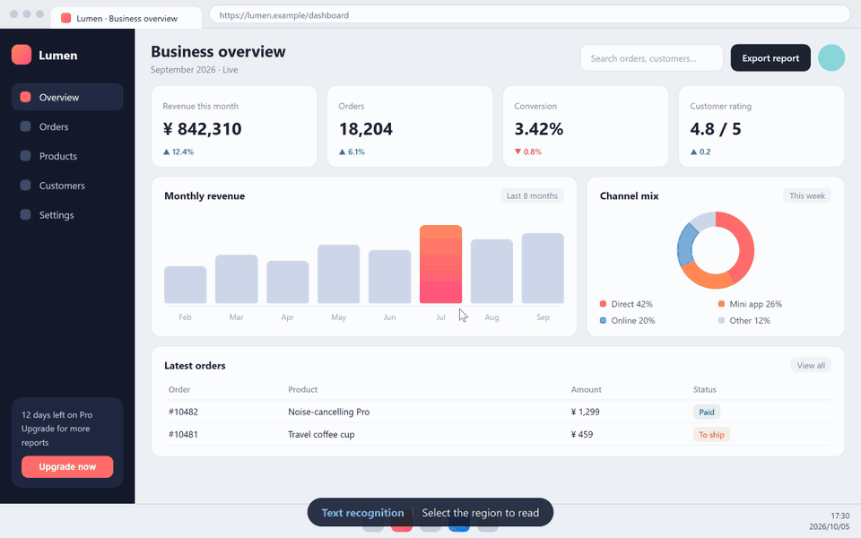
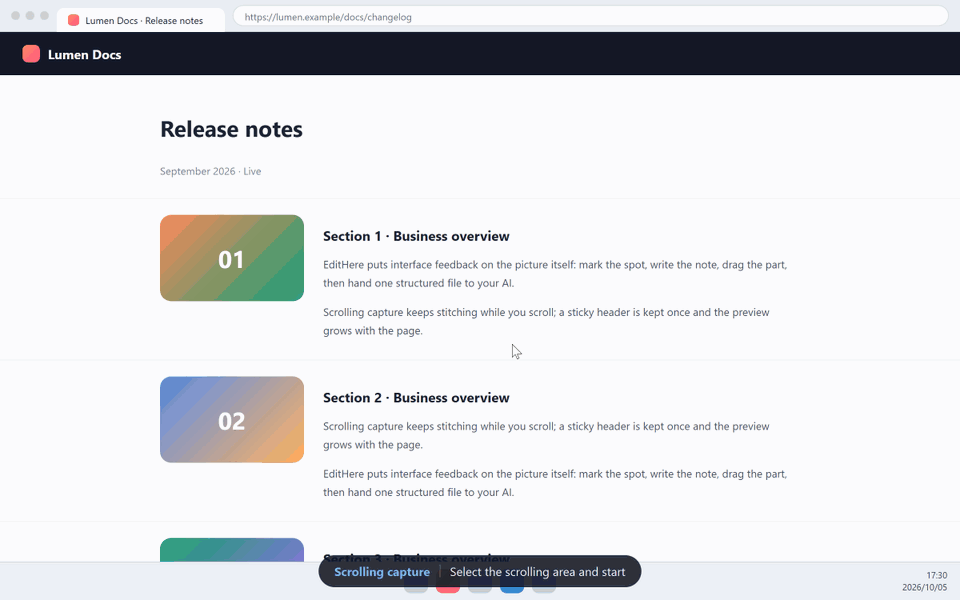
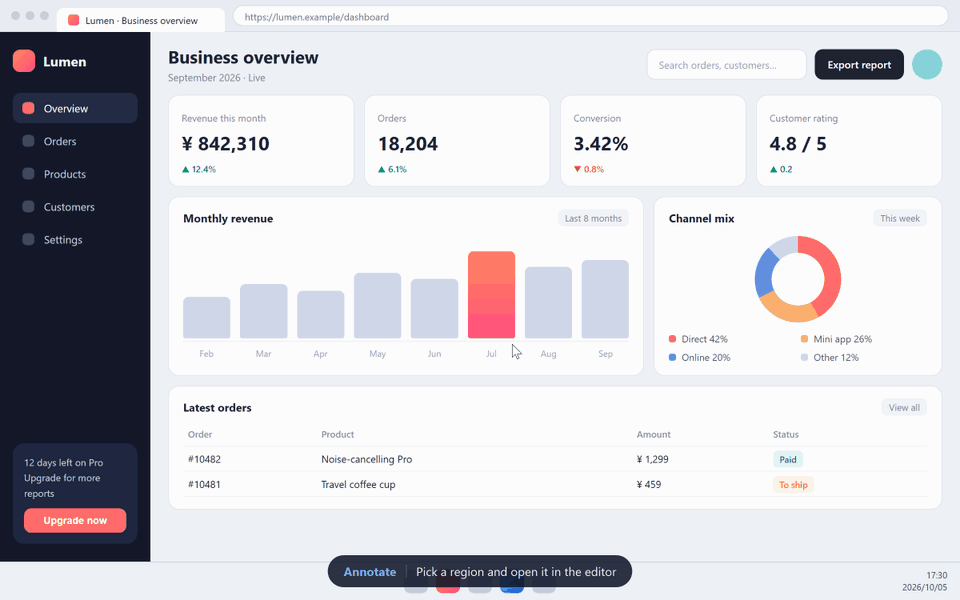
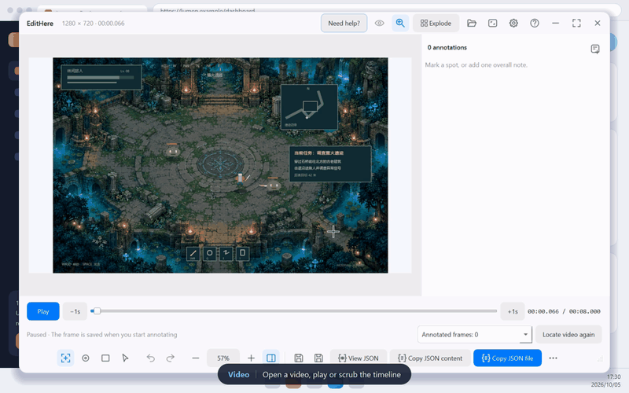

<p align="center">
  
</p>
<h1 align="center"><picture><source media="(prefers-color-scheme: dark)" srcset="assets/brand/edithere-wordmark-light.svg"></picture></h1>
<p align="center"><b>EditHere</b> — show your AI exactly what to change.</p>
<p align="center">Capture the screen, mark it up, drag parts into place, or pause a video and leave your notes.<br>EditHere turns “change <i>this</i>, <i>here</i>” into structured feedback your AI can act on directly.</p>

<p align="center">
  <a href="https://github.com/Inginnng/EditHere/releases/latest"></a>
  <a href="https://github.com/Inginnng/EditHere/releases"></a>
  
  <a href="LICENSE"></a>
  <a href="https://github.com/Inginnng/EditHere/stargazers"></a>
</p>

<p align="center">
  <a href="#download-and-install"><b>Download</b></a> ·
  <a href="#set-up-with-ai">Set up with AI</a> ·
  <a href="#features">Features</a> ·
  <a href="docs/AGENT-CLI.en.md">AI integration</a> ·
  <a href="docs/USER-GUIDE.en.md">User guide</a> ·
  <a href="https://github.com/Inginnng/EditHere/releases">Release notes</a>
</p>
<p align="center"><a href="README.md">简体中文</a> · <b>English</b></p>

<p align="center">
  
</p>
<p align="center"><sub>↑ The agent starts a review → you leave your notes in EditHere → “Finish and return to AI” → the agent reads the feedback and makes the changes</sub></p>

## Why EditHere?

“Move the button in the top-right a bit to the left.” “Make that card bigger.” “This colour is off.” When you iterate on an interface with AI, you know exactly what you want — yet you spend paragraphs describing **where** and **how much**, and the AI still edits the wrong thing.

**EditHere puts your feedback on the picture itself.** Mark a region, write a note, or drag a part to where it belongs. EditHere packs the original image, the coordinates of every note and every layout change into one JSON file for Codex, Claude Code, WorkBuddy, Qcode or any other AI tool.

|                         | Describing it in text                  | With EditHere                                                  |
| ----------------------- | -------------------------------------- | -------------------------------------------------------------- |
| **Point at something**  | “the button near the top right”        | One click, exact pixel coordinates                             |
| **Change the layout**   | “move it left a bit, ~20% bigger”      | Drag and resize; real before/after coordinates are recorded    |
| **Many changes at once**| One long message, easy to miss things  | Every note is numbered and tied to its spot on the image       |
| **Video / animation**   | “around second 3”                      | Pause on the frame; each note carries a timestamp and the frame |
| **Hand it to AI**       | Paste a screenshot, then type          | The AI opens the image via the CLI and receives your feedback when you click Finish |

Use it for web and app interfaces, game HUDs, charts, design reviews — anything where you need to say exactly what to change and where.

## Features

### 🖼️ Capture · Smart select · Pin

Press the global shortcut to freeze the screen. **Hover to detect interface elements**, scroll the wheel to widen or narrow the selection, or drag your own box. Once the region is settled, a toolbar appears above it — annotate, text recognition, scrolling capture, pin, save, copy — with corners, shadow and border in the style column beside it. Changes show up immediately, pins stay on top, and you can pin as many as you like.

<p align="center"></p>

<details>
<summary>Magnifier, colour picker, capture history and more</summary>

- While dragging, a **magnifier** follows the pointer with pixel coordinates and `RGB` / `HEX` / `HSV` / `HSL` readouts; press `C` to pick and copy a colour.
- Arrow keys move the pointer one pixel at a time; `Shift` / `Ctrl` + arrows shrink or grow the region by one pixel.
- Fixed ratios (1:1, 4:3, 16:9, 9:16, custom); click the size to type an exact width and height.
- The last 20 captures and 10 selections persist across sessions: `<` / `>` browse history, `R` restores the last selection.
- Pins can be resized, rotated, flipped, made translucent, and sent straight to the editor from their context menu.

See [User guide · Capture](docs/USER-GUIDE.en.md#capture) for every shortcut.
</details>

### 🔤 Text recognition (OCR)

Select a region to read its text. Results are listed **line by line**; pick a line to highlight it on the image, then copy one line or all of them. It uses the system's own engine (Windows OCR / macOS Vision): **offline, nothing uploaded, no extra dependencies**.

<p align="center"></p>

### 📜 Scrolling capture

Select a scrolling area and choose **Scrolling capture**. EditHere stitches while you scroll, the preview beside the region grows with the page, and sticky headers are kept only once. It captures in both directions, can scroll for you, trims with one click, and finishes straight into annotation.

<p align="center"></p>

### ✍️ Annotate: points, boxes and global notes

**Smart select** a detected element and write your note; drop a **point** on an exact pixel; drag a **box** around any area; add a **global note** about the whole picture. Each note is numbered and tied to its location, and the whole set exports as JSON in one click.

<p align="center"></p>

### 💥 Explode: drag the layout you want

**Explode** splits the picture into movable parts. **Drag them, resize them in proportion, or type exact coordinates.** Every move becomes a note that records the region before and after; the old spot is left empty for your AI to fill. A hundred times more precise than “move it left a bit”.

<p align="center"></p>

### 🎬 Annotate video by timestamp

Open a video, play or scrub the timeline, and **pause on the frame you want to change** to annotate it; play on and annotate another moment. Tags on the timeline bring annotated frames back at any time. In the exported JSON every note carries its timestamp and frame screenshot — ideal for reviewing animations, games and interaction flows.

<p align="center"></p>

See the [video annotation guide](docs/VIDEO-ANNOTATION.en.md) for the format.

### 🤖 Hand it to your AI

EditHere **never calls a model**; its job is to make the feedback unambiguous:

- **Manually:** copy the JSON text, the JSON file or the annotated image and paste it into any AI.
- **Automatically:** with the [`edithere` skill](skills/edithere/SKILL.md) and `edithere-cli` from this repository, the AI runs `edithere-cli annotate`, EditHere opens the picture, and the moment you click **“Finish and return to AI”** the AI receives your feedback and carries on. Cancelling or timing out never turns unsubmitted edits into change requests.

One feedback file contains everything:

```jsonc
{
  "image": "data:image/png;base64,…",          // optional: the picture before any change
  "annotationSpace": "result",
  "objects": [
    { "source": {"x1": 1002, "y1": 156, "x2": 1464, "y2": 384},   // a box note
      "movements": [], "annotations": ["Make the conversion drop stand out with a red tag"] },
    { "source": {"x1": 1760, "y1": 50, "x2": 1960, "y2": 110},    // a part moved with Explode
      "movements": [{"to": {"x1": 640, "y1": 40, "x2": 840, "y2": 100}}],
      "annotations": ["Move Export next to the title"] },
    { "source": null, "movements": [], "annotations": ["More breathing room overall"] }  // a global note
  ]
}
```

Field reference: [User guide · Feedback JSON](docs/USER-GUIDE.en.md#feedback-json). Commands and examples: [AI integration and CLI](docs/AGENT-CLI.en.md).

### And also

| | |
| --- | --- |
| 💾 **Projects** | `.edithere` projects embed the image, notes and editing state so you can pick up where you left off; video projects reference the source file and keep annotated frames. |
| 📥 **Any input** | Capture, open, drop or paste PNG / JPEG / WebP / BMP, and MP4 / MOV / WebM videos. |
| 🎨 **Your way** | Light and dark themes, English and Simplified Chinese interface, 22 configurable shortcuts and a customisable toolbar. |
| 🔒 **Local first** | Capture, element detection, OCR and editing all run on your machine; EditHere never uploads your screen. |
| 🖥️ **Cross-platform** | Windows 10 1809+ is fully supported; macOS 14+ and Linux (Ubuntu 24.04) are previews. |

## Set up with AI

Paste this prompt into an AI tool that can use your local terminal and files, such as Codex or Claude Code:

```text
Follow https://github.com/Inginnng/EditHere/blob/codex/native/docs/AI-SETUP.en.md to set up EditHere and the edithere skill for me. Reuse an existing installation or fully extracted ZIP package first; otherwise, install the appropriate version for my operating system. Verify that the CLI works and the skill is in a location recognized by my current AI tool, then explain how to start my first annotation session. Tell me when a system permission prompt requires my action.
```

<details>
<summary>Prefer not to install? Use this prompt for the portable ZIP</summary>

```text
Follow https://github.com/Inginnng/EditHere/blob/codex/native/docs/AI-SETUP.en.md to set up EditHere for Windows without running an installer and the edithere skill for me. Check for an existing fully extracted package first; I can provide its location if needed. Otherwise, download the official Windows ZIP and extract the entire archive into a suitable user directory. Do not run the installer or change startup settings or PATH. Configure the skill to use the absolute path to edithere-cli.exe, and verify the CLI and skill configuration for my current AI tool. Tell me when a system permission prompt requires my action.
```

</details>

Then, inside your project, just say:

> Let me mark up the home page in EditHere, and apply my notes when I'm done.

Your AI tool needs access to your local terminal and files; a web chat alone cannot install software on your computer. See the [AI setup guide](docs/AI-SETUP.en.md) for the full procedure.

## Download and install

| Platform | Download | Notes |
| --- | --- | --- |
| **Windows x64 · Recommended** | [EXE installer](https://github.com/Inginnng/EditHere/releases/latest/download/EditHere-win-x64-setup.exe) | Per-user install, no administrator rights; Start menu entry, uninstaller and project file association. |
| **Windows x64 · Portable** | [ZIP archive](https://github.com/Inginnng/EditHere/releases/latest/download/EditHere-win-x64.zip) | Extract the whole archive and run `EditHere.exe`; keep the DLLs and plugin folders beside it. |
| **macOS · Apple Silicon / Intel** | [Universal DMG](https://github.com/Inginnng/EditHere/releases/latest/download/EditHere-macos-universal.dmg) | Drag `EditHere.app` into Applications; grant Screen Recording before the first capture. |
| **Linux x86_64 · Preview** | [AppImage](https://github.com/Inginnng/EditHere/releases/latest/download/EditHere-linux-x86_64.AppImage) | Make it executable and run it; targets Ubuntu 24.04. See the [Linux guide](docs/LINUX.en.md). |

These links always point to the latest public release; check the [Releases](https://github.com/Inginnng/EditHere/releases) page and the package's `version.txt` for its version.

<details>
<summary>Installation details, platform notes and upgrading</summary>

- The Windows installer defaults to `%LOCALAPPDATA%\Programs\EditHere`. Its components page offers launch at login, adding the CLI to PATH and a desktop shortcut; launch at login and PATH are selected on a new install, and upgrades keep the existing startup registration. Reopen your terminal and AI tools afterwards so they pick up the new PATH. Uninstalling keeps your settings and projects.
- The Windows installer is **not yet code-signed**. Download it from this repository's Releases and verify the [SHA-256 checksums](https://github.com/Inginnng/EditHere/releases/latest/download/SHA256SUMS.txt).
- The minimum Windows target is Windows 10 1809+, developed and tested on Windows 11. The portable ZIP needs no separate Qt, Python, Node or .NET.
- macOS requires 14+ and **is still a preview, without acceptance testing on a physical Mac or Apple notarization**; the scrolling capture backend compiles in the macOS build.
- Linux preview: under Wayland, authorise a monitor first, then select the region in EditHere for manual scrolling capture; without PipeWire or ScreenCast support it falls back to the system region picker for ordinary screenshots. X11 supports manual capture and automatic vertical scrolling. See the [Linux guide](docs/LINUX.en.md).
- **Upgrading:** quit the old version, then run the installer or extract the new ZIP. If launch at login reports an old path, keep the option selected and save to refresh it; saving a project once registers the `.edithere` file association. Older versions' update checks may not recognise the renamed repository, so use the links above for your first upgrade.

</details>

## Quick start

1. **Install** — let your AI do it with the [prompt above](#set-up-with-ai), or download manually.
2. **Capture** — press the global shortcut `Alt + Shift + 2`, or ask your AI to “let me mark up the main page in EditHere”.
3. **Annotate** — points, boxes, global notes, Explode; whatever makes your intent clear.
4. **Hand off** — click “Finish and return to AI”, or copy the JSON into any AI tool.

More actions, shortcuts and examples are in the [user guide](docs/USER-GUIDE.en.md).

## FAQ

<details>
<summary><b>Can it detect every control and all image content?</b></summary>

No. It combines element boundaries exposed by the system with local image analysis to find candidate regions; this is not semantic recognition. When a suggestion doesn't fit, draw the box yourself. Text recognition is a separate action that reads only the region you selected.
</details>

<details>
<summary><b>Are screenshots uploaded?</b></summary>

No. Capture, detection and editing happen locally. If you send feedback yourself or let an AI tool read it, any upload depends on that tool. When you check for updates manually or use the default startup check, EditHere queries stable releases on GitHub and [Gitee](https://gitee.com/InnGing/EditHere) and chooses the newer version.
</details>

<details>
<summary><b>Does it only work with Codex or Claude Code?</b></summary>

No. Feedback is plain JSON plus images, tied to no model provider. Codex and Claude Code can use the companion skill; other tools can use the CLI or a manual import. EditHere includes no model calls and no model credits.
</details>

<details>
<summary><b>Can I use the skill with the portable ZIP?</b></summary>

Yes. Extract the whole Windows ZIP, put the `edithere` skill where your AI tool finds skills, and give the AI the absolute path to `edithere-cli.exe`. No installer and no PATH change needed.
</details>

<details>
<summary><b>Can I save my work and continue later?</b></summary>

Yes. A `.edithere` project keeps the original image, notes and editing state; the JSON you hand to AI carries the change requests of the current session.
</details>

## Documentation

| Document | What's inside |
| --- | --- |
| [User guide](docs/USER-GUIDE.en.md) | Capture, annotation, Explode, export, settings and shortcuts |
| [AI integration and CLI](docs/AGENT-CLI.en.md) | `edithere-cli` commands, skill setup and agent integration |
| [AI setup guide](docs/AI-SETUP.en.md) | Let an AI install and configure EditHere for you |
| [Video annotation](docs/VIDEO-ANNOTATION.en.md) | The video feedback format and workflow |
| [Scrolling capture](docs/LONG-CAPTURE.en.md) | Design and verification of scrolling capture |
| [Linux guide](docs/LINUX.en.md) | AppImage, OCR dependencies and X11 / Wayland behaviour |
| [Build and development](docs/DEVELOPMENT.en.md) | Building from source, tests and packaging |
| [Full changelog (Chinese)](CHANGELOG.md) | Every change, version by version |

## Contributing and feedback

- [Report a problem or suggest an improvement](https://github.com/Inginnng/EditHere/issues). Please include your OS and app versions, steps to reproduce, and a screenshot or sample project you're comfortable sharing.
- QQ group **1018416966** (feedback only); mention you came from GitHub when joining.
- To contribute code, see the [contributing guide (Chinese)](CONTRIBUTING.md).

Thanks to everyone on the [linux.do](https://linux.do/) forum for their suggestions and feedback.

## License and commercial collaboration

The original software is licensed under the [PolyForm Noncommercial License 1.0.0](LICENSE) (SPDX: `PolyForm-Noncommercial-1.0.0`).

Personal, educational, research, charitable and government **noncommercial** use is free — just keep the licence text and the `Required Notice`. **Commercial use requires a written licence from the author**, including embedding EditHere in a product or service you sell or charge for. See [commercial licensing (Chinese)](COMMERCIAL-LICENSE.md) or write to **<inginnng@163.com>**.

The EditHere name and marks are not licensed under these terms; see the [trademark policy (Chinese)](TRADEMARK-POLICY.md). Qt, MinGW and other third-party components are covered by their own licences; see the [third-party notices (Chinese)](packaging/THIRD-PARTY-NOTICES.md).

## Star History

<p align="center">
  <a href="https://star-history.com/#Inginnng/EditHere&Date">
    <picture>
      <source media="(prefers-color-scheme: dark)" srcset="https://api.star-history.com/svg?repos=Inginnng/EditHere&type=Date&theme=dark" />
      <source media="(prefers-color-scheme: light)" srcset="https://api.star-history.com/svg?repos=Inginnng/EditHere&type=Date" />
      
    </picture>
  </a>
</p>
