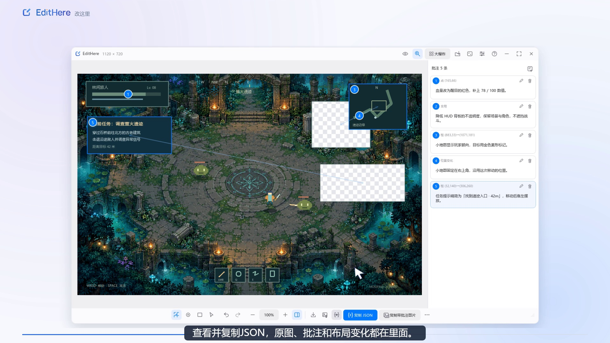
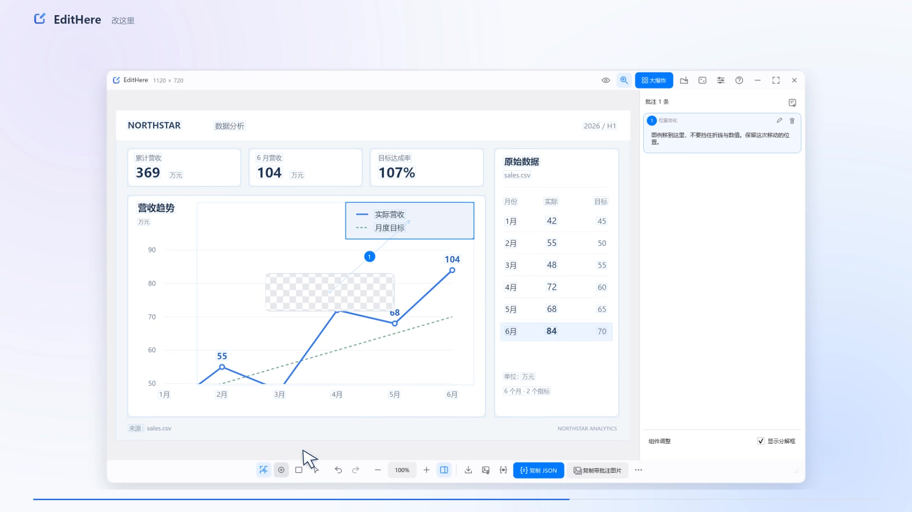

  

<h1 align="center">EditHere · 改这里</h1>

<strong>让 AI 看懂，你想怎么改。</strong>

截图、写下意见、直接调整布局，把修改意图一次交给 AI。

Windows · macOS 预览版 &nbsp; / &nbsp; 本地截图与图像识别

  <a href="#下载与安装">下载</a> ·
  <a href="#功能介绍">功能介绍</a> ·
  <a href="#演示视频">演示视频</a> ·
  <a href="docs/AGENT-CLI.md">接入 AI</a> ·
  <a href="docs/USER-GUIDE.md">使用指南</a> ·
  <a href="CHANGELOG.md">更新日志</a>

  

## 为什么用 EditHere？

“右上角那个按钮再往左一点”“这个卡片大一些”“这里的颜色不对”——和 AI 一起改界面时，想法很清楚，却常常要花很多文字解释位置与范围。

**EditHere 把这些话直接放回画面里。** 你可以圈出区域、写下意见，也可以把图像里的组件拖到想要的位置、调整到合适的大小。最后，把原图、批注以及位置和尺寸变化一起交给 AI，让它结合你的项目继续修改。

它适合网页与应用界面、游戏 HUD、数据图表等需要具体指出“改哪里、怎么改”的场景。

## 功能介绍

| 功能 | 你可以怎么用 |
| --- | --- |
| **截图即批注** | 全局快捷键呼出截图；悬停选块、滚轮切换范围，也可手动画框。松开鼠标，直接开始编辑。 |
| **位置与意见一一对应** | 点选、框选和全局批注配合使用；在侧栏直接写意见，通过编号定位到画面中的具体位置。 |
| **直接调整布局** | 开启“大爆炸”，拖动或缩放图像区域，精确输入坐标与尺寸；调整后的区域仍可添加批注。 |
| **一键交给 AI** | 复制或导出 JSON；也可通过配套 skill 和 CLI，让 AI 打开图片，等你明确完成批注后接收反馈并继续修改。 |
| **保存下来，继续修改** | 导出或复制带批注图片；保存完整项目，之后重新打开接着编辑。支持打开、拖入和粘贴常用图片。 |
| **按自己的习惯操作** | 自由缩放与平移、撤销重做、亮暗主题、自定义快捷键和工具栏；图像区域识别在本机完成。 |

### 把“这里”，指到具体位置

一个点说明细节，一个框明确范围，全局批注补充整体风格。批注与画面同时显示，修改意见不必在聊天记录和截图之间来回找。

### 布局怎么改，直接摆出来

用“大爆炸”选择并调整图像区域：把图例移开、把卡片放大，或精确设置位置和尺寸。移动轨迹和批注一起保留，反馈可以同时表达“原来在哪里”和“希望放到哪里”。

这里调整的是截图中的图像区域。移动后原位置会留空，EditHere 不直接修改网页源码，也不会自动补齐背景。

### 带着上下文，交给你的 AI

一份反馈同时包含：

- **原图**：提供修改前的画面，可选择内嵌到 JSON。
- **批注**：具体位置、范围和文字意见。
- **布局变化**：实际发生的移动与缩放，记录调整前后的区域。

EditHere 负责整理反馈，你可以手动发送给 AI，也可以通过配套 skill 和命令行接入：AI 打开待修改的图片，你在 EditHere 中标注，点击 **“完成并返回 AI”**，AI 再结合项目执行修改。EditHere 本身不调用模型或修改代码。

## 快速开始

1. **截取画面**：启动后按 Windows 的 **Ctrl + Shift + 2**，或 macOS 的 **Command + Shift + 2**；也可以打开、拖入或粘贴图片。
2. **写下修改意见**：点选细节、框选范围，在右侧写批注；整体要求可用全局批注补充。
3. **摆出目标布局**：需要移动或缩放时，开启“大爆炸”并调整对应区域。
4. **把反馈交给 AI**：手动使用时点击“复制 JSON”，连同项目上下文发送；由 AI 发起的标注会话则点击“完成并返回 AI”。也可保存带批注图片或完整项目。

给 AI 的提示词可以这样写，再附上导出的反馈：

> 请根据这份 EditHere 反馈修改当前项目。结合原图理解界面，逐条落实 annotations，并按 changes 中的位置和尺寸调整布局。只修改明确指出的内容；无法判断的部分先说明。

更多操作、快捷键和示例见 [使用指南](docs/USER-GUIDE.md)。

### 在 AI 工作流中使用

安装 EditHere 后，将仓库中的 [`skills/edithere`](skills/edithere/SKILL.md) 复制到 Codex 或 Claude Code 的技能目录，就可以这样发起协作：

> 用 EditHere 让我标注这张界面，等我完成后，再按反馈修改当前项目。

AI 通过 `edithere-cli annotate` 打开图片并等待，你决定何时完成。取消或超时不会把未提交的编辑当成修改要求。已有项目也能通过 CLI 导出反馈，供自己的脚本或 Agent 使用。

完整安装方法、命令和示例见 [AI 与命令行](docs/AGENT-CLI.md)。

## 演示视频

**3 分 10 秒，查看从截图、批注、布局调整到 AI 修改示例的完整流程。**

[播放或下载 1080p 介绍视频](https://github.com/Inginnng/EditHere/releases/download/v0.8.19/EditHere-introduction-1080p.mp4) · [查看所有下载](https://github.com/Inginnng/EditHere/releases/latest)

视频包含游戏界面和数据图表两个案例。AI 对话与修改结果为案例演示，交给 AI 的步骤由用户完成。

## 下载与安装

| 平台 | 下载 | 使用方式 |
| --- | --- | --- |
| **Windows x64 · 推荐** | [下载安装器 EXE](https://github.com/Inginnng/EditHere/releases/download/v0.8.20/EditHere-0.8.20-win-x64-setup.exe) | 当前用户安装，无需管理员权限；提供开始菜单、卸载入口和项目文件关联。 |
| **Windows x64 · 便携版** | [下载便携版 ZIP](https://github.com/Inginnng/EditHere/releases/download/v0.8.20/EditHere-0.8.20-win-x64.zip) | 完整解压后运行 `EditHere.exe`，保留同目录的 DLL 和插件文件夹。 |
| **macOS · Apple Silicon / Intel** | [下载通用版 DMG](https://github.com/Inginnng/EditHere/releases/download/v0.8.20/EditHere-0.8.20-macos-universal.dmg) | 打开 DMG，将 `EditHere.app` 拖到其中的“Applications”入口。首次截图需授予屏幕录制权限。 |

Windows 安装器默认安装到 `%LOCALAPPDATA%\Programs\EditHere`。组件页可选择登录时启动、加入 PATH 和桌面快捷方式；新安装默认勾选登录启动与 PATH，升级时保留已有启动登记状态。安装后重新打开终端和 AI 工具，才能读取新的 PATH。卸载保留用户设置与项目。

Windows 最低构建目标为 Windows 10 1809+，在 Windows 11 上开发与测试；便携包无需另行安装 Qt、Python、Node 或 .NET。macOS 要求 14+，已通过构建与自动测试，**仍处于预览阶段，尚未实机验收和 Apple 公证**。

当前仓库与发布包保持私有，下载需要登录已获访问权限的 GitHub 账号。完整版本列表见 [Releases](https://github.com/Inginnng/EditHere/releases)。

从 HelpDesign 旧版本升级

退出旧版后，运行安装器或完整解压新便携包。原设置和 `.helpdesign` 项目继续兼容。如果开机启动提示旧路径，保持自启勾选并保存即可刷新路径；如果被 Windows 系统禁用，请在系统的启动应用设置中手动恢复。在新程序中保存一次项目可更新文件关联。旧版自动更新可能不识别新仓库地址，首次更名升级请使用上面的下载入口。

## 常见问题

**能识别所有控件和图像内容吗？** 不能。程序结合系统公开的元素边界与本地图像分析寻找候选区域，不是 OCR 或语义识别；没有选准时，可以手动画框补充。

**截图会自动上传吗？** 截图、图像识别和编辑在本机完成，不会由更新检查上传。你自行发送反馈，或允许接入的 AI 工具读取反馈后，是否上传取决于该工具的工作方式；手动或开启启动检查更新时，EditHere 会访问 GitHub。

**换一个 AI 工具还能用吗？** 反馈以 JSON 和图片交付，不绑定模型服务。Codex、Claude Code 可使用配套 skill，其他工具也可通过 CLI 或手动导入接收反馈。EditHere 不内置模型调用，也不提供模型额度。

**能保存下次继续改吗？** 可以。保存 `.helpdesign` 项目可保留原图、批注与编辑状态；复制给 AI 的 JSON 则用于传达本次修改意见。

## 使用许可与商业合作

原创软件采用 [PolyForm Noncommercial License 1.0.0](LICENSE)。许可证允许的非商业用途免费使用、修改和分享；除许可明确允许的情形外，商业使用须先取得单独的付费书面授权。详情见 [使用许可](LICENSING.md)。

产品集成、定制开发和联合开发等合作，请联系 **[inginnng@163.com](mailto:inginnng@163.com)**，并说明使用场景、授权主体和预计规模。完整申请说明见 [商业授权](COMMERCIAL-LICENSE.md)。

本项目采用源码可用许可，不是 MIT 或 OSI 批准的开源软件。Qt、MinGW 等第三方组件遵循各自许可证，见 [第三方声明](packaging/THIRD-PARTY-NOTICES.md)。

## 文档与反馈

[使用指南](docs/USER-GUIDE.md) · [AI 与命令行](docs/AGENT-CLI.md) · [构建与开发](docs/DEVELOPMENT.md) · [更新日志](CHANGELOG.md) · [报告问题或建议](https://github.com/Inginnng/EditHere/issues)

反馈问题时，请附上系统版本、程序版本、复现步骤，以及方便分享的截图或示例项目。
