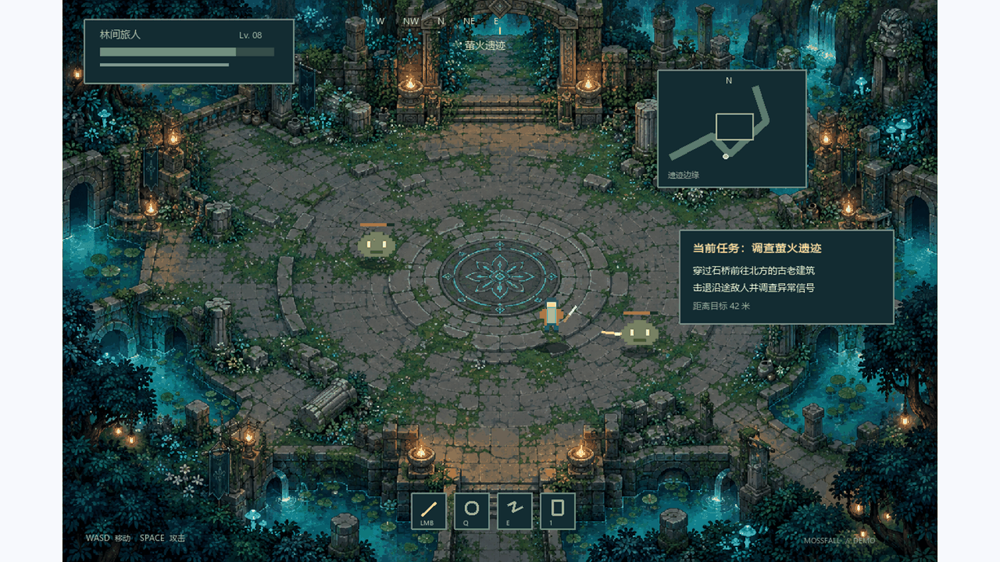
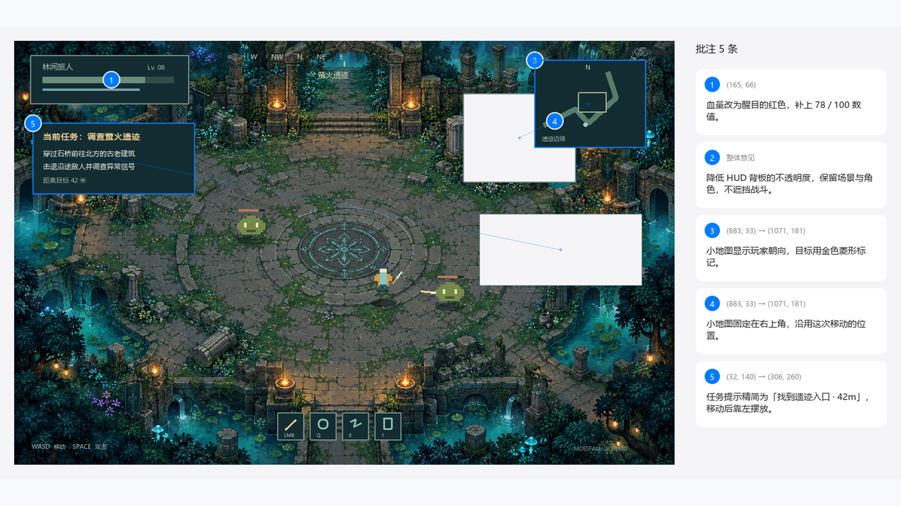
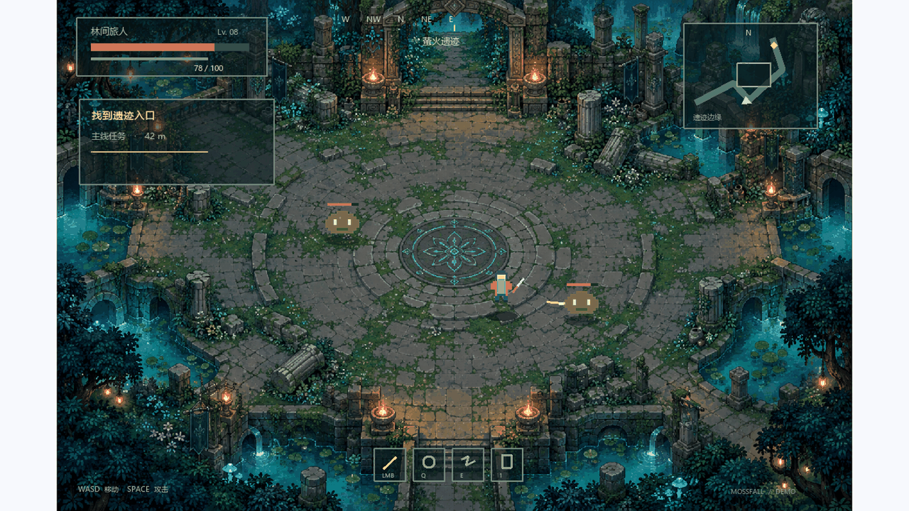

<p align="center">
  
</p>
<h1 align="center"><picture><source media="(prefers-color-scheme: dark)" srcset="assets/brand/edithere-wordmark-light.svg"></picture></h1>
<p align="center">改这里</p>
<p align="center"><strong>让 AI 看懂，你想怎么改。</strong></p>
<p align="center">截图、写下意见、直接调整布局，把修改意图一次交给 AI。</p>
<p align="center">Windows · macOS 预览版   /   本地截图与图像识别</p>
<p align="center">
  <a href="#下载与安装">下载</a> ·
  <a href="#让-ai-帮你安装">让 AI 帮你安装</a> ·
  <a href="#功能介绍">功能介绍</a> ·
  <a href="#演示视频">演示视频</a> ·
  <a href="docs/AGENT-CLI.md">接入 AI</a> ·
  <a href="docs/USER-GUIDE.md">使用指南</a> ·
  <a href="CHANGELOG.md">更新日志</a> ·
  <a href="#致谢">致谢</a>
</p>
<p align="center"><strong>简体中文</strong> · <a href="README.en.md">English</a></p>

<p align="center">
  <a href="#演示视频">
    
  </a>
</p>

## 让 AI 帮你安装

在支持本机终端与文件操作的 AI 工具中（如 Codex、Claude Code），复制下面整段提示词即可开始配置。GitHub 代码块右上角提供复制按钮。

```text
请按 https://github.com/Inginnng/EditHere/blob/codex/native/docs/AI-SETUP.md 帮我配置 EditHere 和 edithere skill。优先复用已安装或已完整解压的程序；如果没有，再按我的操作系统安装。完成后验证 CLI 可以调用、skill 已放到当前 AI 工具能识别的位置，并告诉我如何发起第一次标注。需要我完成的系统授权请明确提示。
```

<details>
<summary>想免安装使用？复制这个免安装版提示词</summary>

```text
请按 https://github.com/Inginnng/EditHere/blob/codex/native/docs/AI-SETUP.md 帮我在 Windows 上配置 EditHere 免安装版和 edithere skill。先检查是否已有完整解压的程序，需要时我可以提供所在路径；否则下载官方 Windows ZIP 并完整解压到合适的用户目录。不要运行安装器，不要修改开机启动或 PATH。让 skill 使用 edithere-cli.exe 的绝对路径，并验证 CLI 和当前 AI 工具的技能配置。需要我完成的系统授权请明确提示。
```

</details>

这需要 AI 工具拥有本机终端和文件操作权限；仅有网页聊天窗口无法直接安装本机程序。系统权限提示由你确认。源码与发布包已公开，AI 可从官方仓库读取指南并下载。详细步骤见 [AI 安装指南](docs/AI-SETUP.md)。

## 为什么用 EditHere？

“右上角那个按钮再往左一点”“这个卡片大一些”“这里的颜色不对”——和 AI 一起改界面时，想法很清楚，却常常要花很多文字解释位置与范围。

**EditHere 把这些话直接放回画面里。** 你可以圈出区域、写下意见，也可以把图像里的组件拖到想要的位置、调整到合适的大小。最后，把原图、批注以及位置和尺寸变化一起交给 AI，让它结合你的项目继续修改。

它适合网页与应用界面、游戏 HUD、数据图表等需要具体指出“改哪里、怎么改”的场景。

## 功能介绍

| 功能                   | 你可以怎么用                                                                                       |
| ---------------------- | -------------------------------------------------------------------------------------------------- |
| **截图即批注**         | 全局快捷键呼出截图；悬停选块、滚轮切换范围，也可手动画框。松开鼠标，直接开始编辑。                 |
| **位置与意见一一对应** | 点选、框选和全局批注配合使用；在侧栏直接写意见，通过编号定位到画面中的具体位置。                   |
| **直接调整布局**       | 开启“大爆炸”，拖动或缩放图像区域，精确输入坐标与尺寸；调整后的区域仍可添加批注。                   |
| **一键交给 AI**        | 复制或导出 JSON；也可通过配套 skill 和 CLI，让 AI 打开图片，等你明确完成批注后接收反馈并继续修改。 |
| **保存下来，继续修改** | 导出或复制带批注图片；保存完整项目，之后重新打开接着编辑。支持打开、拖入和粘贴常用图片。           |

## 快速开始

1. **安装 EditHere**：让你的 AI Agent 帮你安装 EditHere，提示词见[让 AI 帮你安装](#让-ai-帮你安装)。

2. **截取画面**：在你的项目中说“用 EditHere 帮我标注主页面”，或者用 EditHere 的全局快捷键截取画面。

<p align="center"></p>

3. **进行批注**在 EditHere 中进行批注：

- **点批注**：为一个小点进行批注
- **框批注**：自动识别矩形元素，直接点击识别的矩形批注，也可以手动画框
- **全局意见**：针对项目全局的需求批注
- **大爆炸**：直接将识别的元素全部切分，可以移动元素，移动将会记录移动前后的位置，提供给 AI 参考，移动后原位置会留空，但你的 AI 会补上此处原本该有的内容。

<p align="center"></p>

更多操作、快捷键和示例见 [使用指南](docs/USER-GUIDE.md)。

4. **反馈 AI**

一份 JSON 同时包含：
- **原图**：提供修改前的画面，可选择内嵌到 JSON。
- **批注**：具体位置、范围和文字意见。
- **布局变化**：实际发生的移动与缩放，记录调整前后的区域。

EditHere 负责整理反馈，你可以手动发送给 AI，也可以通过配套 skill 和命令行接入：AI 打开待修改的图片，你在 EditHere 中标注，点击 **“完成并返回 AI”**，AI 再结合项目执行修改。EditHere 本身不调用模型或修改代码。

<p align="center"></p>

### 在 AI 工作流中使用

安装或完整解压免安装版后，将仓库中的 [`skills/edithere`](skills/edithere/SKILL.md) 复制到 Codex 或 Claude Code 的技能目录，并让 AI 知道 CLI 的位置，就可以这样发起协作。也可以用上面的 [AI 安装提示词](#让-ai-帮你安装) 完成配置：

> 用 EditHere 让我标注这张界面。

AI 通过 `edithere-cli annotate` 打开图片并等待，你决定何时完成。取消或超时不会把未提交的编辑当成修改要求。已有项目也能通过 CLI 导出反馈，供自己的脚本或 Agent 使用。

完整安装方法、命令和示例见 [AI 与命令行](docs/AGENT-CLI.md)。

## 演示视频

下面这段演示完整走了一遍流程：截取画面、添加批注、调整布局，以及让 AI 发起标注并接收反馈。视频配有中文旁白与字幕，界面为中文。

<p align="center"></p>

上面是压缩后的动图预览。完整宣传视频（MP4，约 250 MB）可在 [Releases](https://github.com/Inginnng/EditHere/releases/download/v0.9.4/EditHere-0.9.4-promo.mp4) 下载，其他版本见 [全部发布](https://github.com/Inginnng/EditHere/releases)。

## 下载与安装

| 平台                              | 下载                                                                                                                 | 使用方式                                                                              |
| --------------------------------- | -------------------------------------------------------------------------------------------------------------------- | ------------------------------------------------------------------------------------- |
| **Windows x64 · 推荐**            | [下载安装器 EXE](https://github.com/Inginnng/EditHere/releases/download/v0.9.4/EditHere-0.9.4-win-x64-setup.exe)   | 当前用户安装，无需管理员权限；提供开始菜单、卸载入口和项目文件关联。                  |
| **Windows x64 · 免安装版**        | [下载免安装版 ZIP](https://github.com/Inginnng/EditHere/releases/download/v0.9.4/EditHere-0.9.4-win-x64.zip)       | 完整解压后运行`EditHere.exe`，保留同目录的 DLL 和插件文件夹。                         |
| **macOS · Apple Silicon / Intel** | [下载通用版 DMG](https://github.com/Inginnng/EditHere/releases/download/v0.9.4/EditHere-0.9.4-macos-universal.dmg) | 打开 DMG，将`EditHere.app` 拖到其中的“Applications”入口。首次截图需授予屏幕录制权限。 |

Windows 安装器默认安装到 `%LOCALAPPDATA%\Programs\EditHere`。组件页可选择登录时启动、加入 PATH 和桌面快捷方式；新安装默认勾选登录启动与 PATH，升级时保留已有启动登记状态。安装后重新打开终端和 AI 工具，才能读取新的 PATH。卸载保留用户设置与项目。

Windows 安装包尚未进行代码签名。请从本仓库 Releases 下载，并核对[程序包 SHA-256 校验和](https://github.com/Inginnng/EditHere/releases/download/v0.9.4/SHA256SUMS.txt)。

Windows 最低构建目标为 Windows 10 1809+，在 Windows 11 上开发与测试；免安装版压缩包无需另行安装 Qt、Python、Node 或 .NET。macOS 要求 14+，已通过构建与自动测试，**仍处于预览阶段，尚未实机验收和 Apple 公证**。

源码与发布包已公开，可直接查看代码和下载。完整版本列表见 [Releases](https://github.com/Inginnng/EditHere/releases)。

<details>
<summary>从旧版本升级</summary>

退出旧版后，运行安装器或完整解压新免安装版压缩包。如果开机启动提示旧路径，保持自启勾选并保存即可刷新路径；如果被 Windows 系统禁用，请在系统的启动应用设置中手动恢复。在新程序中保存一次项目可登记 `.edithere` 文件关联。旧版自动更新可能不识别新仓库地址，首次更名升级请使用上面的下载入口。

</details>

## 常见问题

**能识别所有控件和图像内容吗？** 不能。程序结合系统公开的元素边界与本地图像分析寻找候选区域，不是 OCR 或语义识别；没有选准时，可以手动画框补充。

**截图会自动上传吗？** 截图、图像识别和编辑在本机完成，不会由更新检查上传。你自行发送反馈，或允许接入的 AI 工具读取反馈后，是否上传取决于该工具的工作方式；手动或开启启动检查更新时，EditHere 会访问 GitHub。

**换一个 AI 工具还能用吗？** 反馈以 JSON 和图片交付，不绑定模型服务。Codex、Claude Code 可使用配套 skill，其他工具也可通过 CLI 或手动导入接收反馈。EditHere 不内置模型调用，也不提供模型额度。

**不用安装器，免安装版也能使用 skill 吗？** 可以。完整解压 Windows ZIP，保留程序、CLI、DLL 和插件文件夹，将 `edithere` skill 放到 AI 工具能识别的技能目录，并告诉 AI `edithere-cli.exe` 的绝对路径即可。不必运行安装器，也不必加入 PATH；配置后可用“用 EditHere 让我标注这张图”发起协作。

**能保存下次继续改吗？** 可以。保存 `.edithere` 项目可保留原图、批注与编辑状态；复制给 AI 的 JSON 则用于传达本次修改意见。

## 致谢

感谢 [linux.do](https://linux.do/) 论坛各位的建议与反馈。

## 使用许可与商业合作

原创软件采用 [MIT License](LICENSE)（SPDX: `MIT`）

许可之外的优先支持、定制开发、联合开发与品牌合作，欢迎联系 **[inginnng@163.com](mailto:inginnng@163.com)**，详见 [商业合作与支持](COMMERCIAL-LICENSE.md)。这些合作**不是**使用本软件的前提。

EditHere 的名称与标识不随 MIT 许可授予。Qt、MinGW 等第三方组件遵循各自许可证，见 [第三方声明](packaging/THIRD-PARTY-NOTICES.md)。

## 文档与反馈

[使用指南](docs/USER-GUIDE.md) · [AI 与命令行](docs/AGENT-CLI.md) · [构建与开发](docs/DEVELOPMENT.md) · [更新日志](CHANGELOG.md) · [报告问题或建议](https://github.com/Inginnng/EditHere/issues)

反馈问题时，请附上系统版本、程序版本、复现步骤，以及方便分享的截图或示例项目。
