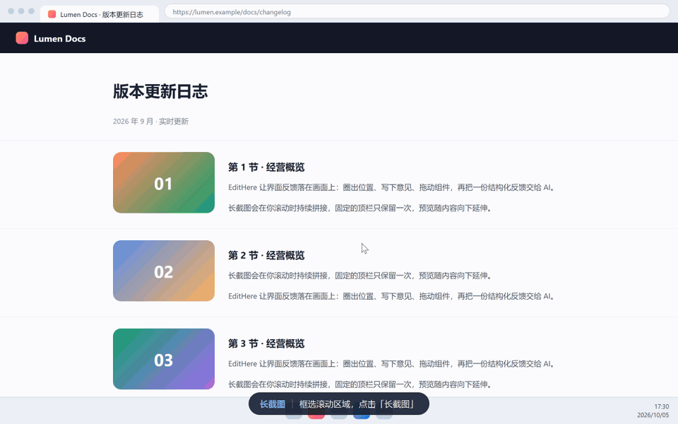
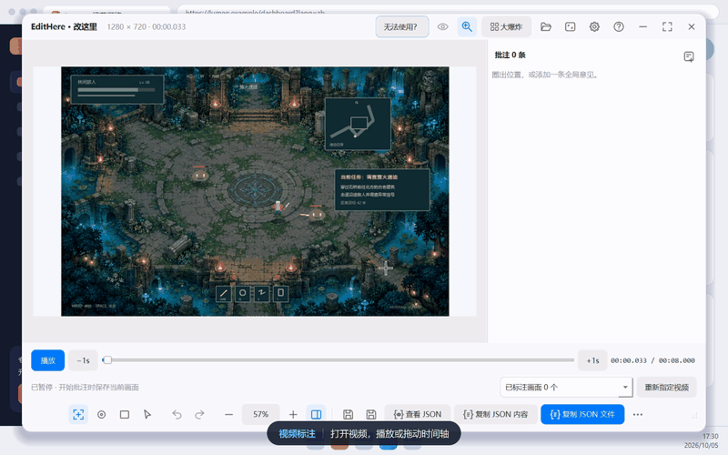

<p align="center">
  
</p>
<h1 align="center"><picture><source media="(prefers-color-scheme: dark)" srcset="assets/brand/edithere-wordmark-light.svg"></picture></h1>
<p align="center"><b>改这里</b> —— 让 AI 看懂，你想怎么改。</p>
<p align="center">截图、圈画、拖动组件，或者暂停视频写下意见。<br>EditHere 把「改哪里、怎么改」整理成一份 AI 能直接执行的结构化反馈。</p>

<p align="center">
  <a href="https://github.com/Inginnng/EditHere/releases/latest"></a>
  <a href="https://github.com/Inginnng/EditHere/releases"></a>
  
  <a href="LICENSE"></a>
  <a href="https://github.com/Inginnng/EditHere/stargazers"></a>
</p>

<p align="center">
  <a href="#下载与安装"><b>下载</b></a> ·
  <a href="#让-ai-帮你安装">让 AI 帮你安装</a> ·
  <a href="#功能一览">功能一览</a> ·
  <a href="docs/AGENT-CLI.md">接入 AI</a> ·
  <a href="docs/USER-GUIDE.md">使用指南</a> ·
  <a href="CHANGELOG.md">更新日志</a>
</p>
<p align="center"><b>简体中文</b> · <a href="README.en.md">English</a></p>

<p align="center">
  
</p>
<p align="center"><sub>↑ AI 发起标注 → 你在 EditHere 里写意见 → 「完成并返回 AI」→ AI 读取反馈并修改</sub></p>

## 为什么需要 EditHere？

「右上角那个按钮再往左一点」「这张卡片大一些」「这里颜色不对」——和 AI 一起改界面时，想法很清楚，却要花大量文字描述**位置和范围**，AI 还常常改错地方。

**EditHere 把意见直接放回画面里。** 你圈出区域、写下意见，或者直接把组件拖到想要的位置；EditHere 把原图、批注坐标和布局变化打包成一份 JSON，交给 Codex、Claude Code、WorkBuddy、Qcode 等任何 AI 工具。

|                    | 只用文字描述                 | 用 EditHere                                         |
| ------------------ | ---------------------------- | --------------------------------------------------- |
| **指出位置**       | 「右上角偏下那个按钮」       | 点一下，精确到像素坐标                              |
| **描述布局调整**   | 「往左挪一点，大概大 20%」   | 直接拖动、缩放，记录前后的真实坐标                  |
| **多处修改**       | 一长段话，容易遗漏           | 每条意见一个编号，与画面位置一一对应                |
| **视频 / 动画问题** | 「大概第 3 秒那里」          | 暂停到那一帧批注，自动带时间戳与帧截图              |
| **交给 AI**        | 复制截图 + 粘贴文字          | AI 调用 CLI 打开画面，等你点「完成」后直接拿到反馈  |

适合网页与应用界面、游戏 HUD、数据图表、设计稿走查等一切需要说清「改哪里、怎么改」的场景。

## 功能一览

### 🖼️ 截图 · 智能选块 · 贴图

全局快捷键冻结屏幕，**悬停即识别界面元素**，滚轮切换更大或更小的范围，也可以手动拖框。选区定下后上方出现工具条：批注、文字识别、长截图、贴图、保存、复制；右侧样式列可调圆角、阴影与边框，所见即所得，支持置顶，可以同时置顶多张。

<p align="center"></p>

<details>
<summary>放大镜、取色、截图历史等更多细节</summary>

- 拖动选区时指针旁有**放大镜**，附带像素坐标与 `RGB` / `HEX` / `HSV` / `HSL` 读数；按 `C` 进入取色并复制颜色值。
- 方向键逐像素移动指针，`Shift` / `Ctrl` + 方向键收缩或扩展选区 1 像素。
- 固定比例（1:1、4:3、16:9、9:16、自定义）；点击尺寸可键入精确宽高。
- 最近 20 张截图与 10 个选区跨会话保留，`<` / `>` 翻看历史，`R` 恢复上次选区。
- 贴图支持缩放、旋转、翻转、透明度、阴影开关，右键第一项「批注」直接送进编辑器。

完整快捷键见 [使用指南 · 截图](docs/USER-GUIDE.md#截图)。
</details>

### 🔤 文字识别（OCR）

框选区域即可识别文字，结果**逐行**列出，点一行就在原图上高亮对应位置，可复制全部或单行。使用系统自带引擎（Windows OCR / macOS Vision），**不联网、不上传、不新增依赖**。

<p align="center"></p>

### 📜 长截图

框选滚动区域后点击「长截图」，边滚动边拼接，右侧缩略预览随内容延伸，固定的顶栏只保留一次。支持上下双向采集、自动滚动、一键裁剪，完成后直接进入批注。

<p align="center"></p>

### ✍️ 批注：点、框、全局意见

**智能选块**点中识别出的元素即可写意见；**点批注**精确指向某个像素；**框批注**拖出任意范围；**全局意见**针对整个画面。每条意见带编号，与画面位置一一对应，最后一键导出 JSON。

<p align="center"></p>

### 💥 大爆炸：直接拖出你想要的布局

一键把画面拆成可移动的组件，**拖动、等比缩放、输入精确坐标**。每次移动自动记为一条批注，记录移动前后的真实区域；原位置留空，交给 AI 补上应有的内容。比「往左挪一点」精确一百倍。

<p align="center"></p>

### 🎬 视频按时间点批注

打开视频，播放或拖动时间轴，**暂停在需要修改的那一帧**直接批注；继续播放，在另一个时间点再批注。点击时间轴上的标签随时回到已批注画面。导出的 JSON 每条意见都带时间戳与帧截图，适合动画、游戏、交互流程的走查。

<p align="center"></p>

格式说明见 [视频标注说明](docs/VIDEO-ANNOTATION.md)。

### 🤖 一键交给 AI

EditHere 本身**不调用任何模型**，它只负责把反馈整理清楚：

- **手动**：复制 JSON 内容 / JSON 文件 / 带批注图片，粘贴给任意 AI。
- **自动**：配合仓库内的 [`edithere` skill](skills/edithere/SKILL.md) 和 `edithere-cli`，AI 执行 `edithere-cli annotate` 打开画面并等待；你点击 **「完成并返回 AI」** 后，AI 立即收到反馈继续修改。取消或超时不会把未提交的编辑当成修改要求。

一份反馈 JSON 同时包含：

```jsonc
{
  "image": "data:image/png;base64,…",          // 可选：修改前的原图
  "annotationSpace": "result",
  "objects": [
    { "source": {"x1": 1002, "y1": 156, "x2": 1464, "y2": 384},   // 框批注
      "movements": [], "annotations": ["转化率下降要更醒目，改成红色标签"] },
    { "source": {"x1": 1760, "y1": 50, "x2": 1960, "y2": 110},    // 大爆炸移动
      "movements": [{"to": {"x1": 640, "y1": 40, "x2": 840, "y2": 100}}],
      "annotations": ["导出按钮挪到标题旁边"] },
    { "source": null, "movements": [], "annotations": ["整体留白再大一些"] }  // 全局意见
  ]
}
```

完整字段见 [使用指南 · 反馈 JSON](docs/USER-GUIDE.md#反馈-json)，命令与示例见 [AI 与命令行](docs/AGENT-CLI.md)。

### 还有这些

| | |
| --- | --- |
| 💾 **项目保存** | `.edithere` 项目内嵌原图、批注与编辑状态，随时重新打开接着改；视频项目引用源文件并保存已标注帧。 |
| 📥 **多种输入** | 截图、打开、拖入或粘贴 PNG / JPEG / WebP / BMP，以及 MP4 / MOV / WebM 等视频。 |
| 🎨 **外观与快捷键** | 浅色 / 深色主题，简体中文 / English 界面，22 项快捷键与底部工具栏均可自定义。 |
| 🔒 **本地优先** | 截图、元素识别、OCR、编辑全部在本机完成，EditHere 不会上传你的画面。 |
| 🖥️ **跨平台** | Windows 10 1809+ 正式支持；macOS 14+ 与 Linux（Ubuntu 24.04）为预览版。 |

## 让 AI 帮你安装

在能操作本机终端与文件的 AI 工具中（如 Codex、Claude Code），复制下面整段提示词即可完成配置：

```text
请按 https://github.com/Inginnng/EditHere/blob/codex/native/docs/AI-SETUP.md 帮我配置 EditHere 和 edithere skill。优先复用已安装或已完整解压的程序；如果没有，再按我的操作系统安装。完成后验证 CLI 可以调用、skill 已放到当前 AI 工具能识别的位置，并告诉我如何发起第一次标注。需要我完成的系统授权请明确提示。
```

<details>
<summary>想免安装使用？复制这个免安装版提示词</summary>

```text
请按 https://github.com/Inginnng/EditHere/blob/codex/native/docs/AI-SETUP.md 帮我在 Windows 上配置 EditHere 免安装版和 edithere skill。先检查是否已有完整解压的程序，需要时我可以提供所在路径；否则下载官方 Windows ZIP 并完整解压到合适的用户目录。不要运行安装器，不要修改开机启动或 PATH。让 skill 使用 edithere-cli.exe 的绝对路径，并验证 CLI 和当前 AI 工具的技能配置。需要我完成的系统授权请明确提示。
```

</details>

配置完成后，在你的项目里说一句：

> 用 EditHere 让我标注一下首页，等我完成后按我的意见修改。

这需要 AI 工具拥有本机终端和文件权限；仅有网页聊天窗口无法安装本机程序。详细步骤见 [AI 安装指南](docs/AI-SETUP.md)。

## 下载与安装

| 平台 | 下载 | 说明 |
| --- | --- | --- |
| **Windows x64 · 推荐** | [安装器 EXE](https://github.com/Inginnng/EditHere/releases/latest/download/EditHere-win-x64-setup.exe) | 当前用户安装，无需管理员权限；提供开始菜单、卸载入口和项目文件关联。 |
| **Windows x64 · 免安装** | [ZIP 压缩包](https://github.com/Inginnng/EditHere/releases/latest/download/EditHere-win-x64.zip) | 完整解压后运行 `EditHere.exe`，保留同目录的 DLL 和插件文件夹。 |
| **macOS · Apple Silicon / Intel** | [通用版 DMG](https://github.com/Inginnng/EditHere/releases/latest/download/EditHere-macos-universal.dmg) | 将 `EditHere.app` 拖入 Applications；首次截图需授予屏幕录制权限。 |
| **Linux x86_64 · 预览** | [AppImage](https://github.com/Inginnng/EditHere/releases/latest/download/EditHere-linux-x86_64.AppImage) | 赋予执行权限后直接运行，目标环境 Ubuntu 24.04；详见 [Linux 说明](docs/LINUX.md)。 |

下载入口始终指向最新正式版，具体版本以 [Releases](https://github.com/Inginnng/EditHere/releases) 页面和包内 `version.txt` 为准。

<details>
<summary>安装细节、平台说明与旧版升级</summary>

- Windows 安装器默认安装到 `%LOCALAPPDATA%\Programs\EditHere`。组件页可选择登录时启动、加入 PATH 和桌面快捷方式；新安装默认勾选登录启动与 PATH，升级时保留已有启动登记状态。安装后需重新打开终端和 AI 工具才能读取新的 PATH。卸载会保留用户设置与项目。
- Windows 安装包**尚未代码签名**，请从本仓库 Releases 下载，并核对 [SHA-256 校验和](https://github.com/Inginnng/EditHere/releases/latest/download/SHA256SUMS.txt)。
- Windows 最低构建目标为 Windows 10 1809+，在 Windows 11 上开发与测试；免安装版无需另装 Qt、Python、Node 或 .NET。
- macOS 要求 14+，**仍处于预览阶段，尚未 Apple 公证**；长截图后端已在 macOS 构建中编译通过。
- Linux 预览版：Wayland 下先授权显示器，再由 EditHere 框选并手动长截图；缺少 PipeWire 或 ScreenCast 时回退系统选区，仅支持普通截图。X11 支持手动采集与自动纵向滚动。详见 [Linux 说明](docs/LINUX.md)。
- **从旧版升级**：退出旧版后运行安装器或完整解压新版。若开机启动提示旧路径，保持自启勾选并保存即可刷新；在新程序中保存一次项目可登记 `.edithere` 文件关联。旧版自动更新可能不识别新仓库地址，首次更名升级请使用上面的下载入口。

</details>

## 快速上手

1. **安装**：让 AI 按[上面的提示词](#让-ai-帮你安装)帮你装好，或手动下载。
2. **截取画面**：按全局快捷键 `Alt + Shift + 2`，或对 AI 说「用 EditHere 帮我标注主页面」。
3. **写下意见**：点、框、全局意见、大爆炸，怎么说得清楚就怎么来。
4. **交给 AI**：点「完成并返回 AI」，或复制 JSON 发给任意 AI。

更多操作、快捷键和示例见 [使用指南](docs/USER-GUIDE.md)。

## 常见问题

<details>
<summary><b>能识别所有控件和图像内容吗？</b></summary>

不能。程序结合系统公开的元素边界与本地图像分析寻找候选区域，这不是语义识别；没有选准时可以手动画框补充。「文字识别」是另一项功能，只读取你选中区域里的文字。
</details>

<details>
<summary><b>截图会自动上传吗？</b></summary>

不会。截图、图像识别和编辑都在本机完成。你自行发送反馈，或允许接入的 AI 工具读取反馈后，是否上传取决于该工具；手动检查更新或默认开启的启动检查时，EditHere 会查询 GitHub 与 [Gitee](https://gitee.com/InnGing/EditHere) 的正式发行版，选择较新的版本。可在设置中关闭启动检查。
</details>

<details>
<summary><b>只能配合 Codex / Claude Code 使用吗？</b></summary>

不是。反馈以 JSON 和图片交付，不绑定任何模型服务。Codex、Claude Code 可使用配套 skill，其他工具可通过 CLI 或手动导入接收反馈。EditHere 不内置模型调用，也不提供模型额度。
</details>

<details>
<summary><b>免安装版也能使用 skill 吗？</b></summary>

可以。完整解压 Windows ZIP，将 `edithere` skill 放到 AI 工具能识别的技能目录，并告诉 AI `edithere-cli.exe` 的绝对路径即可，不必运行安装器或加入 PATH。
</details>

<details>
<summary><b>能保存下次继续改吗？</b></summary>

可以。`.edithere` 项目保留原图、批注与编辑状态；复制给 AI 的 JSON 则用于传达本次修改意见。
</details>

## 文档

| 文档 | 内容 |
| --- | --- |
| [使用指南](docs/USER-GUIDE.md) | 截图、批注、大爆炸、导出、设置与快捷键的完整说明 |
| [AI 与命令行](docs/AGENT-CLI.md) | `edithere-cli` 命令、skill 配置与 Agent 接入 |
| [AI 安装指南](docs/AI-SETUP.md) | 让 AI 自动完成安装与配置 |
| [视频标注说明](docs/VIDEO-ANNOTATION.md) | 视频反馈格式与使用方式 |
| [长截图实现参考](docs/LONG-CAPTURE.md) | 长截图的设计与验证 |
| [Linux 说明](docs/LINUX.md) | AppImage、OCR 依赖与 X11 / Wayland 行为 |
| [构建与开发](docs/DEVELOPMENT.md) | 从源码构建、测试与打包 |
| [更新日志](CHANGELOG.md) | 每个版本的变化 |

## 参与与反馈

- [报告问题或提出建议](https://github.com/Inginnng/EditHere/issues)：请附上系统版本、程序版本、复现步骤，以及方便分享的截图或示例项目。
- QQ 群 **1018416966**（反馈专用），加群时请说明来自 GitHub。
- 参与开发见 [贡献指南](CONTRIBUTING.md)。

感谢 [linux.do](https://linux.do/) 论坛各位的建议与反馈。

## 许可与商业合作

原创软件采用 [PolyForm Noncommercial License 1.0.0](LICENSE)（SPDX: `PolyForm-Noncommercial-1.0.0`）。

个人、教育、研究、慈善、政府等**非商业用途**可以免费使用、修改和分发，只需保留许可文本与 `Required Notice`。**商业用途需要作者的书面授权**——包括营利性企业的内部部署，以及把 EditHere 内置进对外销售或收费的产品与服务。详见 [商业授权与合作](COMMERCIAL-LICENSE.md)，联系 **[inginnng@163.com](mailto:inginnng@163.com)**。

`0.9.3` 至 `0.10.3` 的旧版本曾以 MIT 发布，那些副本按其当时随附的许可继续有效。详见 [许可说明](LICENSING.md) 的历史版本说明。

EditHere 的名称与标识不随本许可授予，使用规范见 [商标与品牌政策](TRADEMARK-POLICY.md)。Qt、MinGW 等第三方组件遵循各自许可证，见 [第三方声明](packaging/THIRD-PARTY-NOTICES.md)。

## Star History

<p align="center">
  <a href="https://star-history.com/#Inginnng/EditHere&Date">
    <picture>
      <source media="(prefers-color-scheme: dark)" srcset="https://api.star-history.com/svg?repos=Inginnng/EditHere&type=Date&theme=dark" />
      <source media="(prefers-color-scheme: light)" srcset="https://api.star-history.com/svg?repos=Inginnng/EditHere&type=Date" />
      
    </picture>
  </a>
</p>
